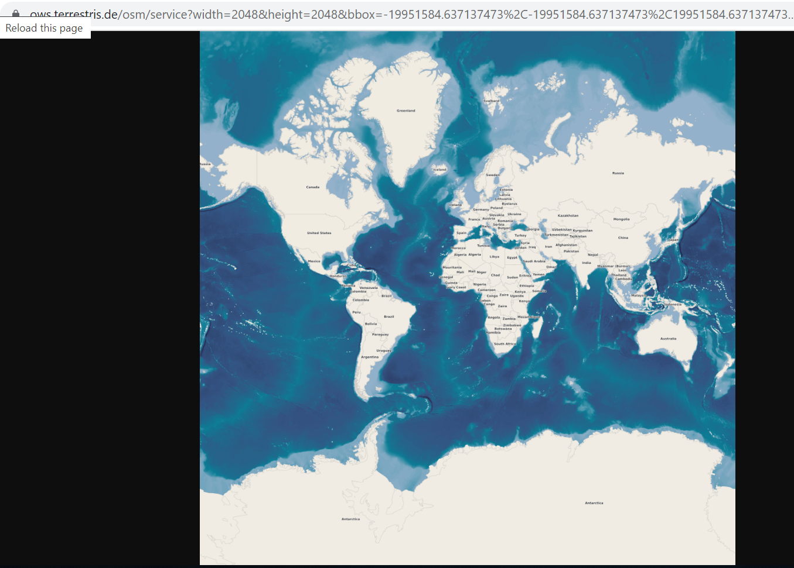

## WMS vs WMTS

### WMS
#### API Reference
- [GetMap](https://github.com/TykTechnologies/tyk-gateway-docker)
- [exportImage](https://hoydedata.no/arcgis/rest/services/DTM/ImageServer/exportImage?bbox=-516478.5,6399795.0,1211121.75,9013488.25)
- [operations](http://opengeospatial.github.io/e-learning/wms/text/operations.html)

#### Querying WMS service

Backtracking the request

You can request the map file directly by simple [GET request](https://ows.terrestris.de/osm/service?width=2048&height=2048&bbox=-19951584.637137473%2C-19951584.637137473%2C19951584.637137473%2C19951584.637137473&srs=EPSG%3A900913&format=image%2Fpng&request=GetMap&service=WMS&styles=&transparent=TRUE&version=1.1.1&layers=OSM-WMS) or even open the map as a file in the browser

### WMTS

### Configuring Tableau to work with WMTS maps
Use this [tutorial](https://kb.tableau.com/articles/howto/creating-a-custom-map-connection) to create a custom ".tms" file.

### Known issues
#### WMS vs WMTS support in Tableau
WMS is officially supported, while WMTS not. There is an open ticket that was created [7 years ago](https://community.tableau.com/s/idea/0874T000000HAaUQAW/detail) which requests to add WMTS support. The only possibility to add WMTS map is by using [".tms" file](https://kb.tableau.com/articles/howto/creating-a-custom-map-connection?_ga=2.25946365.1169060535.1691649322-368932574.1686812577&_gl=1*vceh84*_ga*MzY4OTMyNTc0LjE2ODY4MTI1Nzc.*_ga_8YLN0SNXVS*MTY5MTY2NjcxOS4zLjEuMTY5MTY2NzI0OC4wLjAuMA..).
#### Authorization
WMS in Tableau doesn't support "query parameters". If the Map Server expects token to be passed as a query parameter on each request, the map definition will get it (as you can write the whole URI with the token parameter). But on each consequitive request, the token won't be added and authentication error will pop up.
#### EPSG:3857 vs EPSG:4326
Unfortunately, while supporting a big amount of [SRS/EPSG Codes via WMS](https://help.tableau.com/current/pro/desktop/en-us/maps_mapsources_wms.htm), Tableau expects the WMTS in EPSG:3857, which causes geo points to be moved away from their actual position. The EPSG projection has to be the same in the Map Server and the consumer. E.g *Leaflet* has the **crs** property, that has to be set to "L.CRS.EPSG4326".
