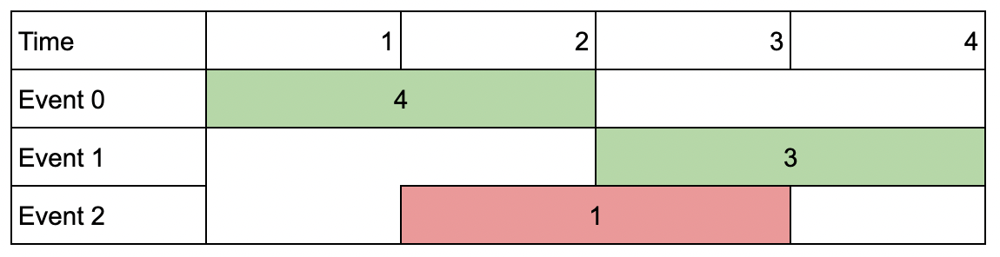

note: finished with https://leetcode.com/submissions/#/45, My Calendar III

## My journey for the  t-shirt
To get a [leetcode](https://leetcode.com/) t-shirt, you need to get 6000 points by solving problems or participating in contests. I've decided to document my journey here.

I've tried to save a longest strike of consecutive days with at least one problem solved. Participating in the daily contentest gives 11 points (1 for the check-in and 10 for the problem itself). Another 25 points may be earned after solving 25 daily-coding problems each month, and 50 pts for all problems each month. Also, missing a day requires to purchase a time-travel ticket that costs 70 points, it's like missing a whole week of solving daily problems.  

There are several more events that give points, like check-in strike of 30 days. The time of the contests is 3:00 AM in my timezone, so I've decided to skip them. 
Even if I couldn't solve a problem, i've tried to understand the solution and save it here. 

The greatest thing about leetcode is that you can see solutions of other people and check how far are you from the best solution.

## New data structures
### Problems
#### 981. Time Based Key-Value Store
*Design a time-based key-value data structure that can store multiple values for the same key at different time stamps and retrieve the key's value at a certain timestamp.*

*Implement the TimeMap class:*
- *TimeMap() Initializes the object of the data structure.*
- *void set(String key, String value, int timestamp) Stores the key key with the value value at the given time timestamp.*
- *String get(String key, int timestamp) Returns a value such that set was called previously, with timestamp_prev <= timestamp. If there are multiple such values, it returns the value associated with the largest timestamp_prev. If there are no values, it returns "".*

```python
class TimeMap:
    def __init__(self):
        self.dataset = {}
        self.timetags = defaultdict(list)

    def set(self, key: str, value: str, timestamp: int) -> None:
        self.timetags[key].append(timestamp)
        self.dataset[(key,timestamp)] = value            

    def get(self, key: str, timestamp: int) -> str:
        if (key,timestamp) in self.dataset:
            return self.dataset[(key,timestamp)]
        cls_ttg = bisect_right(self.timetags[key],timestamp)
        if cls_ttg != 0:
            return self.dataset[(key, self.timetags[key][cls_ttg - 1])]
        else:
            return ""
```
#### 732. My Calendar III
*A k-booking happens when k events have some non-empty intersection (i.e., there is some time that is common to all k events.)*

*You are given some events [startTime, endTime), after each given event, return an integer k representing the maximum k-booking between all the previous events.*

*Implement the MyCalendarThree class:
MyCalendarThree() Initializes the object.
int book(int startTime, int endTime) Returns an integer k representing the largest integer such that there exists a k-booking in the calendar.*
```python
from sortedcontainers import SortedDict
class MyCalendarThree:
    def __init__(self):
        self.timeline = SortedDict()
        
    def book(self, start: int, end: int) -> int:
        self.timeline[(start, True)] = self.timeline.get((start, True), 0) + 1  # the tuple is (time, is_start)
        self.timeline[(end, False)] = self.timeline.get((end, False), 0) + 1

        max_i, tot_i = 0, 0
        for (i, is_start), count in self.timeline.items():
            if is_start:
                tot_i += count
            else:
                tot_i -= count
            if tot_i > max_i:
                max_i = tot_i
        return max_i
```

#### 146. LRU Cache
*Implement the LRUCache class:*

*`LRUCache(int capacity)` Initialize the LRU cache with positive size capacity.*

*`int get(int key)` Return the value of the key if the key exists, otherwise return -1.*

*`void put(int key, int value)` Update the value of the key if the key exists. Otherwise, add the key-value pair to the cache. If the number of keys exceeds the capacity from this operation, evict the least recently used key.*

*The functions get and put must each run in O(1) average time complexity.*

```python
from collections import OrderedDict
class LRUCache:

    def __init__(self, capacity: int):
        self.lru = OrderedDict()
        self.cap = capacity

    def get(self, key: int) -> int:
        if key in self.lru:
            self.lru.move_to_end(key)
            return self.lru[key]
        return -1

    def put(self, key: int, value: int) -> None:
        self.lru[key] = value
        self.lru.move_to_end(key)
        if (len(self.lru) > self.cap):
            self.lru.popitem(False)
```


## Strings

## 2D grids
### Problems
#### 2352. Equal Row and Column Pairs

*Given a **n x n** integer matrix grid, return the number of pairs (ri, cj) such that row ri and column cj are equal.*

While $O(n^3)$ solution is also accepted, the $O(n^2)$ solution is much more interesting. The idea is to count the number of rows and columns and then iterate over all columns and add the number of rows with the same values. The nice trick is to use `zip(*grid)` to iterate over columns.

```python
def equalPairs(self, grid: List[List[int]]) -> int:
    # grid == [[3,2,1],[1,7,6],[2,7,7]]
    pairs = 0
    # Counter({(3, 2, 1): 1, (1, 7, 6): 1, (2, 7, 7): 1})
    row_cnt = Counter(tuple(row) for row in grid)  
    # cols are (3, 1, 2), (2, 7, 7), (1, 6, 7)
    for col in zip(*grid):
        pairs += row_cnt[col]
    return pairs
```

## Stacks and queues

### Problems
#### 150. Evaluate Reverse Polish Notation: given `tokens = ["2","1","+","3","*"]` return `9` because `((2 + 1) * 3) = 9`.


## Dynamic programming (DP)
### Theory
If you are not solving DPs twice a day, it is really recommended to read [this](https://leetcode.com/discuss/general-discussion/458695/dynamic-programming-patterns) article. It is really helpful.

The problem has to have an **optimal substructure** and **overlapping subproblems** (otherwise it can be solved with greedy or divide-and-conquer algorithms).
The latter means that the problem can be broken down into subproblems which are reused several times. The former means that the optimal solution to the problem can be constructed from the optimal solutions to the subproblems. 

The easiest example is *Fibonacci numbers* (F(n) = F(n-1) + F(n-2), F(0) = 0, F(1) = 1). The subproblems are F(0), F(1), F(2), F(3), etc.
The optimal solution to the problem is the sum of the optimal solutions to the subproblems (it is optimal substructure because the optimal solution to the problem can be constructed from the optimal solutions to the subproblems).
The subproblems are overlapping because the same subproblems are used several times. (F(4) is used in F(5) and F(6), F(3) is used in F(4) and F(5), etc.)

#### Top-down DP (memoization) -> recursion
Easier to implement than bottom-up DP, but slower.
```python
memo = {0: 0, 1: 1}
def fib(n):
    if n == 0 or n == 1:
        return n
    if n not in memo:
        memo[n] = fib(n-1) + fib(n-2)
    return memo[n]
```
A cheap implementation of memoization is to use recurtion with `@lru_cache(None)` decorator. It is faster than the above implementation.
```python
from functools import lru_cache
@lru_cache(None)
def fib(n):
    if n == 0 or n == 1:
        return n
    return fib(n-1) + fib(n-2)
```

#### Bottom-up DP (tabulation) -> iteration
Faster, but harder to implement than top-down DP.
```python
def fib(n):
    if n == 0 or n == 1:
        return n
    memo = {0: 0, 1: 1}
    for i in range(2, n+1):
        memo[i] = memo[i-1] + memo[i-2]
    return memo[n]
```

### Problems
#### 1218. Longest Arithmetic Subsequence of Given Difference

*Given an integer array `arr` and an integer `difference`, return the length of the **longest subsequence** in `arr` which is an arithmetic sequence such that the difference between adjacent elements in the subsequence equals `difference`.*

*A subsequence is a sequence that can be derived from `arr` by deleting some or no elements without changing the order of the remaining elements.*

```
Input: arr = [1,2,5,3,4], difference = 1
Output: 4
Explanation: The longest arithmetic subsequence is [1,2,3,4].
```

```python
def longestSubsequence(self, arr: List[int], difference: int) -> int:
    dp = {}  # saves the longest series ending with the key element
    for e in arr:
        before_e_count = dp.get(e - difference, 0)  # e.g if the current element is 3 and differece is -2, what's the dp's value for 5?
        # 0 if 5 not met, 1 if met, 2 if met 7 and then 5, and so on.
        dp[e] = before_e_count + 1
        
    return max(dp.values())
```

#### 1751. Maximum Number of Events That Can Be Attended II

You are given an array of events where `events[i] = [startDayi, endDayi, valuei]`. The ith event starts at `startDayi` and ends at `endDayi`, and if you attend this event, you will receive a value of `valuei`. You are also given an integer `k` which represents the maximum number of events you can attend.

You can only attend one event at a time. If you choose to attend an event, you must attend the entire event. Note that the end day is inclusive: that is, you cannot attend two events where one of them starts and the other ends on the same day.

Return the *maximum sum of values that you can receive by attending events*.

Example:
```
Input: events = [[1,2,4],[3,4,3],[2,3,1]], k = 2
Output: 7
Explanation: Choose the green events, 0 and 1 (0-indexed) for a total value of 4 + 3 = 7.
```

Solution (editorial):
```python
class Solution:
    def maxValue(self, events: List[List[int]], k: int) -> int:
        events = sorted(events)
        n = len(events)
        dp = [[-1] * n for _ in range(k + 1)]

        starts = [start for start, end, value in events]

        def dfs(cur_index, count):
            if count == 0 or cur_index == n:
                return 0
            if dp[count][cur_index] != -1:
                return dp[count][cur_index]

            # Find the nearest available event after attending event 0.
            next_index = bisect_right(starts, events[cur_index][1])
            dp[count][cur_index] = max(dfs(cur_index + 1, count), events[cur_index][2] + dfs(next_index, count - 1))
            return dp[count][cur_index]
        
        return dfs(0, k)
```

## Backtracking (DFS brute force)
Sometimes it is inevitable to use brute force. The idea is to try all possible solutions and check if they are valid. If they are, then return the solution. If not, then backtrack and try another solution. The time complexity is $O(n^m)$, where $n$ is the number of possible solutions and $m$ is the number of steps to check if the solution is valid. The space complexity is $O(m)$, where $m$ is the number of steps to check if the solution is valid. It is better be used with a small number of possible solutions.

### Problems
#### 1601. Maximum Number of Achievable Transfer Requests

*We have n buildings numbered from `0` to `n - 1`. Each building has a number of employees. It's transfer season, and some employees want to change the building they reside in.*

*You are given an array requests where `requests[i] = [from_i, to_i]` represents an employee's request to transfer from building fromi to building toi.*

*All buildings are full, so a list of requests is achievable only if for each building, the net change in employee transfers is zero. This means the number of employees leaving is equal to the number of employees moving in. For example if `n = 3` and two employees are leaving building `0`, one is leaving building `1`, and one is leaving building `2`, there should be two employees moving to building `0`, one employee moving to building `1`, and one employee moving to building `2`.*

*Return **the maximum number of achievable requests**.*

```python
class Solution:
    def maximumRequests(self, n: int, requests: List[List[int]]) -> int:
        ans = 0
        b = [0] * n
        def max_req(idx: int, cnt: int):
            nonlocal ans
            if idx == len(requests):  # all requests were considered
                if any(b[i] != 0 for i in range(n)):  # the balance is not saved, there is a building with non 0 sum of requests
                    return 
                ans = max(ans, cnt)  # keep the gratest number of approved requests
                return
            u, v = requests[idx]
            b[u] -= 1  # approve the request
            b[v] += 1

            max_req(idx + 1, cnt + 1)  # continue with request approval

            b[u] += 1  # decline the request
            b[v] -= 1

            max_req(idx + 1, cnt)  # continue with request denial

        max_req(0, 0)
        return ans
```

#### 1125. Smallest Sufficient Team
In a project, you have a list of required skills `req_skills`, and a list of `people`. The `i`th person `people[i]` contains a list of skills that the person has.

Consider a sufficient team: a set of people such that for every required skill in `req_skills`, there is at least one person in the team who has that skill. We can represent these teams by the index of each person.

For example, team = [0, 1, 3] represents the people with skills people[0], people[1], and people[3].
Return any *sufficient team of the smallest possible size*, represented by the index of each person.

Example:
```
Input: req_skills = ["java","nodejs","reactjs"], people = [["java"],["nodejs"],["nodejs","reactjs"]]
Output: [0,2]
```

Solution clue (Hai_dee on leetcode):
```python
# After some manupulations to represent sets...
# Keep track of some data used by the backtracking algorithm.
        self.unmet_skills = set(req_skills) # Backtracking will remove and readd skills here as needed.
        self.smallest_length = math.inf # Smallest team length so far.
        self.current_team = [] # Current team members.
        self.best_team = [] # Best team we've found, i,e, shortest team that covers skills/
        
		# Here is the backtracking algorithm.
        def meet_skill(skill=0):
			# Base case: All skills are met.
            if not self.unmet_skills:
				# If the current team is smaller than the previous we found, update it.
                if self.smallest_length > len(self.current_team):
                    self.smallest_length = len(self.current_team)
                    self.best_team = self.current_team[::] # In Python, this makes a copy of a list.
                return # So that we don't carry out the rest of the algorithm.
                        
            # If this skill is already met, move onto the next one.
            if req_skills[skill] not in self.unmet_skills:
                return meet_skill(skill + 1)
				# Note return is just to stop rest of code here running. Return values
				# are not caught and used.
            
            # Otherwise, consider all who could meet the current skill.
            for i in skills_to_people[req_skills[skill]]:
                
				# Add this person onto the team by updating the backtrading data.
                skills_added_by_person = people[i].intersection(self.unmet_skills)
                self.unmet_skills = self.unmet_skills - skills_added_by_person
                self.current_team.append(i)
                
				# Do the recursive call to further build the team.
                meet_skill(skill + 1)
                
                # Backtrack by removing the person from the team again.
                self.current_team.pop()
                self.unmet_skills = self.unmet_skills.union(skills_added_by_person)
        
		# Kick off the algorithm.
        meet_skill()        
        return self.best_team 
```

## Trees

When traversing a tree recursively, it is already takes $O(n)$ space for the call stack. Storing nodes' values in a list sometimes is appropriate, the space complexity will remain $O(n)$. (e.g *530. Minimum Absolute Difference in BST* editorial solution).

### Problems
#### 863. All Nodes Distance K in Binary Tree
*Given the **root** of a binary tree, the value of a target node **target**, and an integer **`k`**, return an array of the values of all nodes that have a distance **`k`** from the target node.*

When asked about the distanced nodes, it might be a good idea to change the graph type from directed to undirected connecting childs to their parent and vice versa. Or just add a parent attribute to each node. 

```python
class Solution:
    def distanceK(self, root: Optional[TreeNode], target: Optional[TreeNode], k: int) -> List[int]:
        def dfs_add_parent(node: TreeNode, parent: TreeNode):
            if node is None:
                return
            node.parent = parent
            dfs_add_parent(node.left, node)
            dfs_add_parent(node.right, node)
        
        dfs_add_parent(root, None)
        
        q = deque([(target, 0)])
        seen = {target}
        ans = []
        while q:
            node, dist = q.popleft()
            if dist == k:
                ans.append(node.val)
            for nei in (node.left, node.right, node.parent):
                if nei and nei not in seen:
                    seen.add(nei)
                    q.append((nei, dist + 1))
        return ans
```

#### 110. Balanced Binary Tree
*Given a binary tree, determine if it is 
height-balanced.*

Do this by calculating the height of the tree recursively and checking if the difference between the heights of the left and right subtrees is not greater than 1. Implementation with DFS recursive traversal, which is applied (twice: once for isBalanced() and once for getHeight()) to the left and right subtrees, is not very efficient, but it is easy to understand.
```python
# Definition for a binary tree node.
# class TreeNode:
#     def __init__(self, val=0, left=None, right=None):
#         self.val = val
#         self.left = left
#         self.right = right
class Solution:
    def getHeight(self, root: Optional[TreeNode]) -> int:
        if root is None:
            return 0
        return 1 + max(self.getHeight(root.left), self.getHeight(root.right))
        
    def isBalanced(self, root: Optional[TreeNode]) -> bool:
        if root is None:
            return True
        
        return self.isBalanced(root.left) and self.isBalanced(root.right) and abs(self.getHeight(root.left) - self.getHeight(root.right)) <= 1
```

## Tricky greedy
### Problems
#### 332. Reconstruct Itinerary
*You are given a list of airline tickets where tickets[i] = [fromi, toi] represent the departure and the arrival airports of one flight. Reconstruct the itinerary in order from the "JFK" and return it.*

```python
class Solution:
    def findItinerary(self, tickets: List[List[str]]) -> List[str]:
        ts = defaultdict(list)
        for u, v in tickets:
            ts[u].append(v)
        for t in ts:
            ts[t] = sorted(ts[t], reverse=True)
        
        ans = []
        def dfs(d):
            while ts[d]:
                dfs(ts[d].pop())
            ans.append(d)
        
        dfs("JFK")
        
        return ans[::-1]
```
#### 135. Candy
*There are n children standing in a line. Each child is assigned a rating value given in the integer array ratings. Return the minimum number of candies you need to have to distribute the candies to the children. given each child must have at least one candy and heigher rating get more candies than their neighbours.*

1. Give one candy to each child
2. Scan from the left, if the rating of the current child is greater than the previous one, give one more candy to the current child than to the previous one.
3. Scan from the right, if the rating of the current child is greater than the next one, give one more candy to the current child than to the next one.

```python
class Solution:
    def candy(self, ratings: List[int]) -> int:
        n = len(ratings)
        candies = [1] * n 

        for i in range(1, n):
            if ratings[i] > ratings[i-1]:
                candies[i] = candies[i-1] + 1

        for i in range(n-2, -1, -1):
            if ratings[i] > ratings[i+1]:
                candies[i] = max(candies[i], candies[i+1] + 1)
        
        return sum(candies)
```

## Graphs
### Theory
#### Prim's algorithm (finding MSP)
Prim's algorithm is a greedy algorithm that finds a **Minimum Spanning Tree** (MST) for a weighted undirected graph. It finds a subset of the edges that forms a tree that includes every vertex, where the total weight of all the edges in the tree is minimized. The algorithm operates by building this tree one vertex at a time, from an arbitrary starting vertex, at each step adding the cheapest possible connection from the tree to another vertex. The weight of the edge can be, for example, the manhattan distance between the vertices. The time complexity is $O(E \log V)$, where $E$ is the number of edges and $V$ is the number of vertices. The space complexity is $O(V)$. Each node is added by measuring the distance to the nodes in the MST and adding the closest one. Note, that the weight doesn't tak into account the cummulative distance, but the shortest one from any existing node in a tree. The distance to the nodes in the MST is maintained in a heap. The heap is implemented in `heapq` package. The heap is a list of tuples `(weight, node)`. The heap is sorted by the first element of the tuple. The heap is initialized with the starting node `(0, start)`. The algorithm is implemented in the following way:

```python
from heapq import heappush, heappop
def prim(graph, start):
    mst = []
    visited = set()
    heap = [(0, start)]
    while heap:
        weight, node = heappop(heap)
        if node not in visited:
            visited.add(node)
            mst.append((weight, node))
            for w, neighbor in graph[node]:  # assuming that graph is a defaultdict(list) and graph[node] is a list of tuples [(w1, n1), (w2, n2), ... (wn, nn)]
                if neighbor not in visited:
                    heappush(heap, (w, neighbor))
    return mst
```

### Problems


 ## General tips:
 - Remember that there is `lst.remove(val)` and `del lst[idx]`
 - `lst.find(val, [start, end])` (and also `lst.rfind(val)`) will return *-1* if val is not in lst, `lst.index(val, [start, end])` will throw *ValueError*. The same is for `str.find(substring, start, end)` and `str.index(substring, start, end)`.
 - Binary search *O(log n)* is implemented in `bisect.bisect_left(a, x, lo=0, hi=len(a))` and `bisect.bisect_right(a, x, lo=0, hi=len(a))`. The difference is that *bisect_left* returns the index of the first element that is greater or equal to x, and *bisect_right* returns the index of the first element that is greater than x. If all elements in a are less than x, *bisect_left* returns len(a) and *bisect_right* returns 0. 
 - `defaultdict` is very useful, espesially `defaultdict(list)`
 - Sorted containers (`SortedList`, `SortedDict`, `SortedSet`) are implemented in `sortedcontainers` package. 
 - `set()` intersection is implemented as `set1 & set2`, union as `set1 | set2`, difference as `set1 - set2`, symmetric difference as `set1 ^ set2`.
 - Recursive functions, which potentialy may return the same values should be annotated with `@lru_cache(None)` or `@cache` decorator. It will cache the results of the function calls and return them instead of calling the function again. It is the almost the same as doing DP memoization and saving the results in a dictionary/set.


## Code snippets:
### Trie data structure
```python
class TrieNode:
    def __init__(self):
        self.children = defaultdict(TrieNode)
        self.is_word = False

class Trie:
    def __init__(self):
        self.root = TrieNode()

    def insert(self, word: str) -> None:
        node = self.root
        for c in word:
            node = node.children[c]
        node.is_word = True

    def search(self, word: str) -> bool:
        node = self.root
        for c in word:
            if c not in node.children:
                return False
            node = node.children[c]
        return node.is_word

    def startsWith(self, prefix: str) -> bool:
        node = self.root
        for c in prefix:
            if c not in node.children:
                return False
            node = node.children[c]
        return True
```


### Binary search and sorted insert into a sorted list
```python
bisect.bisect_left(lst, val) # returns the index of the first element that is greater or equal to val
bisect.bisect_right(lst, val) # returns the index of the first element that is greater than val
bisect.insort_left(lst, val) # inserts val into lst so that lst remains sorted. Acually with this one you don't really need sorted collections including heapq, but still better use them for readability and convenience.

# manual implementation
def binary_search(lst, val):
    lo, hi = 0, len(lst)
    while lo < hi:
        mid = (lo + hi) // 2
        if lst[mid] < val:
            lo = mid + 1
        else:
            hi = mid
    return lo
```
### DFS
#### 2D grid DFS
```python
def dfs(grid, start):
    m, n = len(grid), len(grid[0])
    visited = set()
    def dfs_helper(x, y):
        visited.add((x, y))
        for dx, dy in [(1, 0), (-1, 0), (0, 1), (0, -1)]:  # assuming that we can move in 4 directions
            nx, ny = x + dx, y + dy
            if 0 <= nx < m and 0 <= ny < n and (nx, ny) not in visited:
                dfs_helper(nx, ny)
    dfs_helper(start[0], start[1])
```
#### Graph DFS
```python
from collections import defaultdict

graph = defaultdict(list)
for u, v in edges:  # assuming edges is a list of tuples [(u1,v1), (u2,v2), ... (un,vn)]
    graph[u].append(v)
    graph[v].append(u)  # if the graph is directed, this line should be commented out

def dfs(cur, visited):
    visited.add(cur)
    for neighbor in graph[cur]:
        if neighbor not in visited:
            dfs(neighbor, visited)
    return len(visited)  # or other processing, that also could be passed as an argument of dfs
```
#### Find circle in a graph
```python
from collections import defaultdict

graph = defaultdict(list)
for u, v in edges:  # assuming edges is a list of tuples [(u1,v1), (u2,v2), ... (un,vn)]
    graph[u].append(v)
    graph[v].append(u)  # if the graph is directed, this line should be commented out

def dfs(cur, visited, stack):
    visited.add(cur)
    stack.add(cur)
    for neighbor in graph[cur]:
        if neighbor not in visited:
            if dfs(neighbor, visited, stack):
                return True
        elif neighbor in stack:
            return True
    stack.remove(cur)
    return False

def has_cycle():
    visited = set()
    stack = set()
    for node in graph:
        if node not in visited:
            if dfs(node, visited, stack):
                return True
    return False
```

### BFS
#### 2D grid BFS
The queue elemnt may also contain additional information, like the distance from the start point or "height difference" from the last point to findthe minimal-effort-path ([1631](https://leetcode.com/problems/path-with-minimum-effort/description/)). Then, we may use `heapq.heappop` and `heapq.heappush` instead of `collections.deque.popleft` and `collections.deque.append` to maintain the queue in a sorted order.
```python
from collections import deque
def bfs(grid, start):
    m, n = len(grid), len(grid[0])
    visited = set()
    queue = deque([start])
    while queue:
        x, y = queue.popleft()
        visited.add((x, y))
        for dx, dy in [(1, 0), (-1, 0), (0, 1), (0, -1)]:  # assuming that we can move in 4 directions
            nx, ny = x + dx, y + dy
            if 0 <= nx < m and 0 <= ny < n and (nx, ny) not in visited:
                queue.append((nx, ny))
```
#### Graph BFS
```python
from collections import deque
from collections import defaultdict

graph = defaultdict(list)
for u, v in edges:  # assuming edges is a list of tuples [(u1,v1), (u2,v2), ... (un,vn)]
    graph[u].append(v)
    graph[v].append(u)  # if the graph is directed, this line should be commented out

def bfs(graph, start):
    visited = set()
    queue = deque([start])
    while queue:
        node = queue.popleft()
        visited.add(node)
        for neighbor in graph[node]:
            if neighbor not in visited:
                queue.append(neighbor)
```

#### Tree traversal with priority queue (847. Shortest Path visiting all nodes)
Return the length of the shortest path that visits every node. You may start and stop at any node, you may revisit nodes multiple times, and you may reuse edges.
```python
class Solution:
    def shortestPathLength(self, graph: List[List[int]]) -> int:
        n = len(graph)
        if n == 1: return 0
        q = []
        visited = set()

        for node, neis in enumerate(graph):
            state = 1 << node
            q.append((0, node, state))
            visited.add((node, state))
            
        target = (1 << n) - 1

        while q:
            dis, node, state = heappop(q)
            
            for nei in graph[node]:
                nei_state = 1 << nei | state
                if nei_state == target: return dis + 1
                if (nei, nei_state) in visited: continue
                heappush(q, (dis + 1, nei, nei_state))
                visited.add((nei, nei_state))
```


### Disjoint set Union-Find
```python
# ranked Disjoint set Union-Find implementation 
class UnionFind:
    def __init__(self, n):
        self.parent = list(range(n))
        self.rank = [0] * n

    def find(self, x):
        if self.parent[x] != x:
            self.parent[x] = self.find(self.parent[x])
        return self.parent[x]

    def union(self, x, y):
        px, py = self.find(x), self.find(y)
        if px == py:
            return False
        if self.rank[px] < self.rank[py]:
            self.parent[px] = py
        elif self.rank[px] > self.rank[py]:
            self.parent[py] = px
        else:
            self.parent[py] = px
            self.rank[px] += 1
        return True


# usage
uf = UnionFind(n)
for x, y in edges:
    uf.union(x, y)

# get the number of disjoint sets
len(set(uf.find(x) for x in range(n)))

# get the number of elements in the largest disjoint set
# max(uf.parent.count(uf.find(x)) for x in range(n))
final_parents = [uf.find(x) for x in range(n)]
max(final_parents, key=final_parents.count)
```

### Prefix sum
```python
# 1D prefix sum
prefix_sum = [0]
for x in lst:
    prefix_sum.append(prefix_sum[-1] + x)

# 2D prefix sum
prefix_sum = [[0] * (n + 1) for _ in range(m + 1)]
for i in range(1, m + 1):
    for j in range(1, n + 1):
        prefix_sum[i][j] = prefix_sum[i - 1][j] + prefix_sum[i][j - 1] - prefix_sum[i - 1][j - 1] + grid[i - 1][j - 1]
```

### Slow and fast pointers
```python
slow = fast = head
while fast and fast.next:
    slow = slow.next
    fast = fast.next.next

    # detect a cycle (Floid's algorithm)
    if slow == fast:
        break
```

#### Problems
##### 287. Find the Duplicate Number
*Given an array of integers nums containing n + 1 integers where each integer is in the range [1, n] inclusive.* [solution link](https://leetcode.com/problems/find-the-duplicate-number/solutions/4062178/two-pointer-solution-with-floyd-s-tortoise-and-hare-algorithm-python-javascript-java-and-c/)

Using sort is not allowed, as the space complexity should be $O(1)$. Merge sort (or Timsort, as *sorted()* is implemented in python, using hybrid of merge and insertion sorts) has $O(n)$ space complexity. The idea is to use slow and fast pointers to detect a cycle in a linked list. The cycle is detected when slow and fast pointers meet. Then, we find the start of the cycle by moving one of the pointers to the beginning of the list and moving both pointers with the same speed. The start of the cycle is the duplicate number. The time complexity is $O(n)$, where $n$ is the number of elements in the list. The space complexity is $O(1)$.
```python
class Solution:
    def findDuplicate(self, nums: List[int]) -> int:
        slow = nums[0]
        fast = nums[0]
        
        while True:
            slow = nums[slow]
            fast = nums[nums[fast]]
            if slow == fast:
                break
        
        slow2 = nums[0]
        while slow != slow2:
            slow = nums[slow]
            slow2 = nums[slow2]

        return slow
```

### min/max heap (a.k.a priority queue)

Almost all problems that reqire sort in some way os better to be solved with heap. The most common use case is to find the k-th smallest/largest element in a list. The time complexity is $O(n log k)$, where $n$ is the number of elements in the list and $k$ is the number of elements in the heap. The space complexity is $O(k)$.

```python
import heapq
# for max heap use [-item for item in lst]
heap = []  # or heapiq.heapify(lst)
heapq.heappush(heap, (1, 'one'))
heapq.heappush(heap, (10, 'ten'))
heapq.heappush(heap, (5, 'five'))

while heap:
    print(heapq.heappop(heap))

# (1, 'one') == heap[0]
# (5, 'five')
# (10, 'ten')
heapq.heappushpop(heap, item) # Push item on the heap, then pop and return the smallest item from the heap. More efficient than heappush() followed by heappop().
heapq.heapreplace(heap, item) # Pop and return the smallest item from the heap, and also push the new item. If the heap is empty, IndexError is raised. More efficient than heappop() followed by heappush().
heapq.nlargest(n, iterable[, key]) # == sorted(iterable, key=key, reverse=True)[:n]
heapq.nsmallest(n, iterable[, key]) # == sorted(iterable, key=key)[:n]
```

### Misc. functions
#### GCD (also implemented in `math.gcd()`)
```python
def gcd(a, b):  # Euclid's algorithm
    while b:
        a, b = b, a % b
    return a
```

#### Flatten a list of lists
```python
lst = [[1, 2], [3, 4], [5, 6]]
flat_lst = [item for sublist in lst for item in sublist]
```

#### Matrix transpose
```python
# 2D matrix transpose
matrix = [[1, 2, 3], [4, 5, 6], [7, 8, 9]]
matrix_t = list(zip(*matrix))
# [(1, 4, 7), (2, 5, 8), (3, 6, 9)]
``````